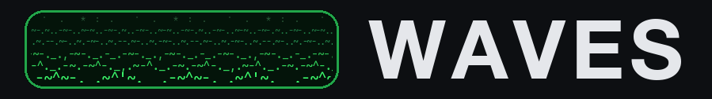
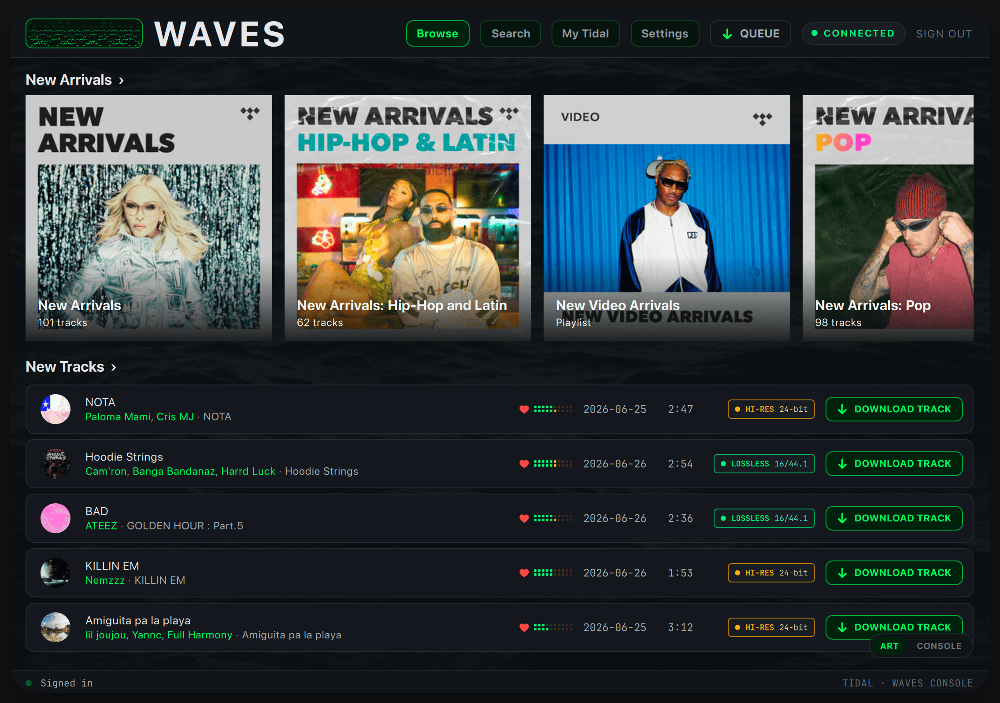
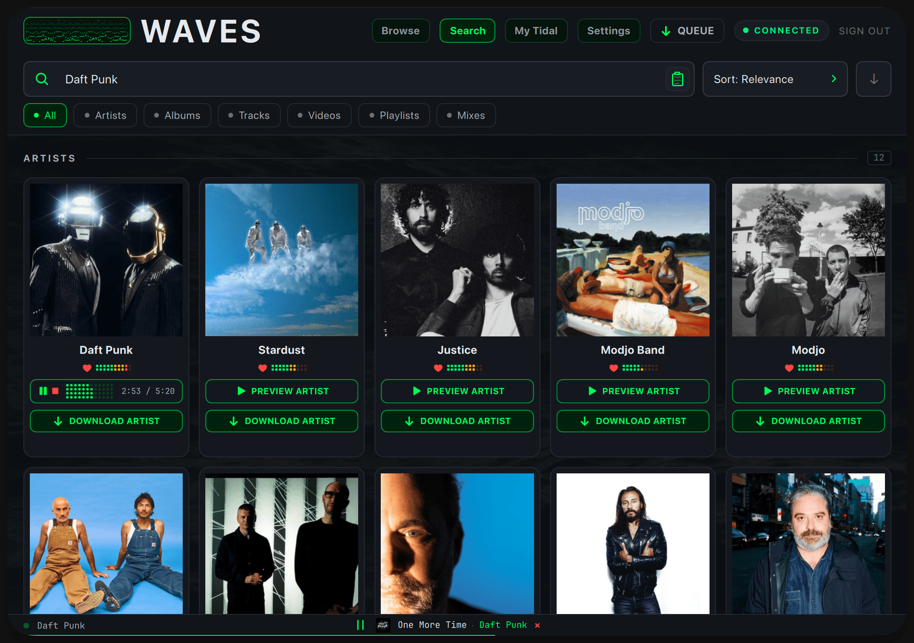

<p align="center">
  
</p>

<p align="center">
  <strong>A native desktop app for downloading music from your own TIDAL account: search‑first, art‑forward, and built for people who'd rather click than type.</strong>
</p>

<p align="center">
  <a href="LICENSE"></a>
  <a href="#install"></a>
  <a href="#install"></a>
  <a href="https://github.com/maya-doshi/tidaler"></a>
</p>

<p align="center">
  
  <br>
  <em>Browse new arrivals and grab any track in one click.</em>
</p>

<p align="center">
  
  <br>
  <em>Search anything, preview an artist in place, and download a whole discography.</em>
</p>

Waves is a brand‑new graphical front end for the proven Tidal‑DL‑NG download engine (actively maintained as [**Tidaler**](https://github.com/maya-doshi/tidaler)). It keeps that engine intact and wraps it in a from‑scratch, native desktop UI for macOS, Windows, and Linux (Intel/AMD and Apple‑silicon/ARM).

> A paid TIDAL plan is required. Waves downloads from **your own** account, for your personal use, up to HiRes Lossless / TIDAL MAX (24‑bit, 192 kHz) and Dolby Atmos where available.

## What Waves can do

- Search all of TIDAL from a single bar, or paste a link to open a release instantly.
- Browse artist and album pages rich with cover art, quality badges, and dates you can sort and filter.
- Preview a full track (or an artist's top song) right inside the app before you download.
- Download a track, an album, a playlist, a mix, a music video, or an artist's whole discography in one click.
- Pick exactly what a discography pulls in, and let Waves skip duplicate editions.
- Keep your TIDAL favorites close, however large your library grows.
- Follow every download in a live, grouped queue.
- Write Plex‑friendly tags (ReplayGain volume leveling included), and choose the explicit or clean version.
- Set up FFmpeg with one click, and optionally update Waves from inside the app.
- Run native on macOS, Windows, and Linux, with downloads up to HiRes Lossless and Dolby Atmos.

---

## Standing on the shoulders of others

Waves exists because of a chain of people who built and kept alive a tool a lot of us love. None of this is mine alone, and I want that to be the first thing you read, not a footnote.

- **exislow** created Tidal‑DL‑NG, the project everything here descends from. The original repository and account disappeared from GitHub, and as far as I know exislow never returned. The work was, and is, excellent. Thank you.
- After that, members of the community picked it up and kept it running. Some of those forks were taken down too, or wound down over time. Everyone who spent their own hours keeping this alive has my gratitude.
- Today it lives on as **[Tidaler](https://github.com/maya-doshi/tidaler)**, maintained by **[maya-doshi](https://github.com/maya-doshi/)** in their spare time. Waves is built directly on Tidaler: its backend _is_ Tidaler's backend (more on that below). Thank you, maya‑doshi, for keeping the lights on.
- And underneath all of it sits **[tidalapi](https://github.com/tamland/python-tidal)**, the Python TIDAL client the rest of the stack is built on. It's the layer at the very bottom: every search, every login, and every track that comes down happens because tidalapi is quietly speaking to TIDAL on Waves' behalf. Tidal‑DL‑NG began by wrapping it, and Tidaler and Waves rest on it still; none of them could exist without it. Most people will never see it, which is the sign of a good foundation. Thank you to everyone who has built and maintained it.

I'm a sucker for a beautiful graphical interface and tend to avoid the command line, but I seem to be in the minority, so the GUI side of tools like Tidaler doesn't get as much attention as the engine underneath. Waves is my way of giving back in a way that's genuinely useful (and, honestly, scratches my own itch): a polished, native GUI that doesn't touch what already works so well.

**Waves is, and always will be, open source under the same license as Tidal‑DL‑NG and Tidaler** (see [License](#license)).

---

## A new face, and an engine kept sharp

The single most important design rule of Waves: **don't break what works, but never stop improving what can be.** Both halves carry equal weight. The parts that already earned their keep in Tidal‑DL‑NG (and live on in Tidaler), TIDAL authentication, the multithreaded / multi‑chunk download engine, metadata tagging, quality handling, and configuration, are that upstream code, used as‑is wherever it still does its job well. The other half is just as deliberate: where that same code hit a real limit (a slow write to a network drive, a handshake storm pegging the CPU, a file that could be left half‑written), Waves improves it in place rather than leaving it be. Nothing is rewritten for its own sake, and nothing that meets a genuine problem is left untouched just because it came from upstream.

Concretely, Waves is a self‑contained UI package (`tidaler/waves_ui/`) that _imports_ Tidaler's existing objects (`Settings`, `Tidal`, `Download`, search) and presents them through a Qt Quick interface. The download/backend code is the upstream Tidaler code, kept intact apart from **a handful of small, surgical changes**: a six‑line tweak so an in‑progress segment can be aborted mid‑chunk (Waves stops/quits instantly instead of waiting on a network read); an optional `keep_album` flag on the per‑track download so the "best of both" edition merge can tag a borrowed track under a chosen edition; a hardened final move that swaps each finished file into place atomically, so an interrupted download can never leave a half‑written file in your library; pooled, reused connections so track segments stop paying a fresh encrypted handshake each (the fix for downloads pegging the CPU); a post‑download container repair so segmented tracks report their real length in strict players; large batched writes with retry, so a network drive sees a few big writes per track instead of hundreds of tiny ones; and some defensive security hardening. Everything else is used as‑is.

To be just as plain about what is new: it's mine. I wrote the interface, the in-app updater, the managed ffmpeg install, and the packaging that ships it all as a signed desktop app, and that comes to about two thirds of the code in this repository. The rest is the download engine that Tidal-DL-NG built and Tidaler keeps alive, carrying the surgical improvements described above.

---

## What's new in Waves

Everything below is **new in Waves**, layered on top of the Tidal‑DL‑NG engine described above:

- **A from‑scratch native UI**: a calm, dark "console" theme (CRT phosphor‑green) drawn in PySide6 / Qt Quick. No web view, no Electron; one real desktop window.
- **Browse, where Waves opens**: TIDAL's editorial front page (New Arrivals, TIDAL Rising, the full genre / mood / decade catalogue), rendered art‑first with live cover mosaics. Every page drills down for real, with hover **Preview / Download** controls and quality badges the whole way. And it stays current on its own: leave Waves running for days and Browse quietly follows what TIDAL is featuring instead of freezing at whatever loaded first.
- **Built‑in updates** (opt‑in): Waves can check for a newer version at launch and, when one is found, a small in‑app notice carries the whole update (download, verify, restart, all in one place); everything is also available from Settings. Updates are **cryptographically signed**, checks are off by default and never send any of your data (see [Privacy](#privacy)).
- **Search‑first**: a single field searches artists, albums, tracks, videos, playlists, and mixes, or resolves a pasted `tidal.com` link and opens the release automatically.
- **Art‑forward results**: cover art inline, results grouped by type, color‑coded quality badges (HI‑RES / LOSSLESS / HIGH), release‑date sorting and filtering, and clickable per‑artist credits. Each section opens as a quick overview (its first few results, artists in a sideways‑scrolling strip) with a SHOW ALL beneath it, and whichever sections you expand stay expanded on your next search.
- **Listen before you download**: play any track (or an artist's top song) as a full, seekable preview streamed from your own account, right where you are. A slim now‑playing bar follows you across every view and jumps back to the track's artist page on click.
- **A built‑in video player**: music videos play right inside Waves, with seek, keyboard controls, and clickable title and artist links. A quality picker offers just the resolutions each video actually has (up to 1080p), switches mid‑stream without losing your place, and remembers your choice. Videos download too, on their own or as part of a playlist or mix.
- **One‑click FFmpeg, with status at a glance**: Waves downloads a trusted, checksum‑verified FFmpeg build for your OS/CPU, no hunting down binaries or editing paths. A color‑coded status light shows where things stand, and anything that would come out degraded without FFmpeg warns you first, with a one‑click path to fix it (see [Acknowledgments](#acknowledgments)).
- **Album & artist as first‑class units**: rich artist pages (bio, discography, EPs & singles, top tracks) with one‑click **download‑the‑whole‑thing** actions.
- **Smart whole‑artist downloads**: per‑source toggles (albums, EPs & singles, features, compilations), keeping just the **most complete edition** of each album by default while preserving genuinely different releases like remasters and live takes. Features and compilations pull only the tracks the artist actually appears on, never another artist's whole album.
- **Most complete, highest‑quality albums, automatically**: when one edition has the bonus tracks and another the better quality, downloading the album quietly builds a _best of both_: a single album that takes each song at its best. Matching is strict (ISRC first), so nothing is dropped or swapped. On by default, tunable in Settings.
- **A real library layout by default**: downloads land in `Artist/[Year] Album/Disc-Track. Artist - Title`, the structure Plex reads natively, instead of flat `Albums/` and `Tracks/` bins. Paths stay fully customizable in Settings, where each path field shows a live example of the exact folders and file name it produces as you type, typos in `{tokens}` are highlighted, and a built-in reference lists every available token with a description, an example value, and a one-click copy.
- **Library‑friendly tagging**: a "clean album‑artist" mode (on by default) writes only the primary artist to the album‑artist tag, so Plex won't mis‑read or split multi‑artist albums. ReplayGain tags are written by default too, so players that support them level volume across your library without touching the audio; tracks TIDAL never measured are left untagged rather than stamped with a wrong level.
- **Explicit, clean, or both**: when a release comes in both explicit and clean versions, keep whichever you prefer, or both side by side.
- **Instant navigation**: pages and cover art you've already seen render instantly from a persistent local cache and quietly refresh in the background. Even a fresh launch paints right away. Tabs remember where you were, too: Search and My TIDAL reopen on the exact page you left, expanded albums, scroll position and all.
- **My TIDAL**: your favorite albums, tracks, artists, videos, playlists, and mixes, with virtualized infinite scroll so large libraries stay smooth. It opens on a **Home** tab that previews your newest additions, up to 24 recent albums and 18 recent tracks; click any shelf heading to open the full list in that tab. Sort any category by recently added, name, release date, or artist, the same control as Search.
- **Grouped download queue**: Completed / Downloading / Queued sections with live per‑track progress, plus per‑album and per‑artist roll‑ups. Every download button acknowledges the click on the spot with an animated QUEUED state, then flips to a live progress bar the moment its download starts.
- **Remembers what you've downloaded**: track and video buttons show DOWNLOADED across sessions, and album, artist, playlist and mix downloads skip the ones you already have (marked HAVE in the queue), fetching only what's missing. Raise the audio quality setting later and lower‑quality copies show DOWNLOAD again, replacing the old file in place with the better one. This only covers downloads made from this version onward; broader library detection is planned for a future update.
- **At home on a NAS or network drive**: downloading straight to an SMB share is a first‑class path. Finished tracks land in a few large writes instead of hundreds of tiny ones, a share that's merely busy is never mistaken for a dead one, brief hiccups retry on their own, and the interface stays responsive throughout. If the folder is genuinely unreachable, one clear dialog says so, and Try again resumes everything you queued, instead of a wall of silently failed tracks. On macOS, the access you grant to a network or external folder is remembered across launches, so the folder you picked stays valid instead of needing a re‑pick.
- **Defense‑in‑depth by default**: helper binaries are verified before they run, FFmpeg against a published SHA‑256 and app updates against an Ed25519 signature that fails closed. Extra defensive input validation is layered in as general hygiene.
- **Privacy‑guarded diagnostics** (opt‑in): a local activity log that scrubs identity information at the moment each line is written, not afterward, so an exported bug report is safe to post publicly. See [Diagnostics](#diagnostics) below.
- **A clean way out, built in**: the bottom of Advanced settings offers "Reset all settings" (every option back to its factory default, you stay signed in) and "Reset application", a true factory reset that erases everything Waves has saved on this computer (settings, sign‑in, caches, ownership history, logs) and closes, so the next launch starts like a brand‑new install. Both ask for confirmation first, and neither can ever touch your downloaded music: the full reset deletes only from a fixed list of the exact files Waves itself writes, with no recursive deletion anywhere in the code path, so it is structurally incapable of removing anything else, even a stray file of yours sitting inside Waves' own folder.
- **Silent background work on Windows**: every FFmpeg job (FLAC extraction, video conversion, previews) runs fully hidden. No more split‑second console pop‑ups stealing focus while you type, a long‑standing annoyance during downloads in the upstream app.
- **Thoughtful touches**: a cinematic open‑water launch sequence (version readout included), an ASCII wave logo that weathers an occasional lightning storm (hover it for the downpour), smooth animations throughout, rows that fade and subtly tilt out of frame as you scroll, a floating back‑to‑top pill on every page, expanding an album scrolls its tracks into view, paste‑to‑open for TIDAL links, and metadata fixing for Plex users. The window reopens at the exact size and position you left it (and nudges itself back onto a visible screen if that monitor is gone), clicking a track row's blank space goes where its title goes, the search box selects its current term on focus so you can just type, and while a page loads the hint rests on the ambient water instead of a black screen.

---

## Privacy

**Privacy is the foundation of this application.** Waves collects nothing about you and has no way of knowing how the application is used: no telemetry, no analytics, no tracking. By default it makes no unsolicited outbound connections at all. It talks to TIDAL only to do what you ask. There are two optional, user‑controlled exceptions, and **neither sends any of your data** (each is a plain request that carries nothing about you):

- Clicking the FFmpeg button downloads a build from the open‑source FFmpeg host.
- Turning on automatic update checks (off by default) lets Waves ask the public GitHub releases page whether a newer version exists. The check only ever _notifies_ you; nothing downloads until you choose to update.

Your credentials and downloads stay on your machine. The same principle carries into the optional diagnostic logger below: nothing leaves your machine unless you export a report yourself.

---

## Diagnostics

Most apps make a bug report cost you your privacy: either describe the problem badly, or hand over a raw log full of your username, file paths, and account details. Waves closes that gap by redacting at the source. Identity information never reaches the log in the first place, so there is nothing to leak, whether you export a report or not.

- **Off by default.** Only warnings and errors are kept until you ask for more. In **Settings → Diagnostics**, turn on **Verbose diagnostics**, reproduce the problem, then click **Export report** for one text file ready to attach to an issue.
- **Redacted at the source, not the export.** Every log handler shares the same filter: usernames, file paths (every OS's forms), hostnames, IP/MAC addresses, emails, session tokens, and your TIDAL account id are replaced with placeholders the instant they would otherwise be written, verbose mode or not. There's no code path left that can write them to disk unredacted.
- **A breadcrumb trail, always on.** Waves keeps the last ~250 activity events in memory at no disk cost. The moment something goes wrong, that trail is written to the log automatically, so even a first-time crash arrives with the events that led up to it.
- **An optional second layer.** "Also hide titles and searches" additionally hashes what you searched for and any track, album, or artist names in the export, for anyone who'd rather not share that either.

The log lives at `waves_dev.log`, next to `crash.log`, in the Waves config folder (`~/Library/Application Support/Waves` on macOS, `%APPDATA%\Waves` on Windows, `~/.config/Waves` on Linux). It's plain text; read it yourself any time you like. Clicking **Export report** doesn't send anything anywhere: it writes a separate, timestamped copy of that redacted data into the same folder, and **Show file** opens it in your file manager so you can move it, attach it, or send it yourself, wherever you want.

**Logs are never transmitted off your device, unless you do it yourself.**

---

## Requirements

- A **paid TIDAL plan** and a one‑time sign‑in (Waves walks you through the browser login on first launch and reuses the cached token afterwards).
- Python 3.12 or 3.13 (if running from source).
- FFmpeg is used for in‑app previews and a few conversions (e.g. some video / hi‑res cases). Waves can install it for you with one click (see above).

---

## Install

Grab the build for your platform from the [**latest release**](../../releases/latest):

| OS      | Intel / AMD (x64)       | ARM (Apple silicon, etc.)       |
| ------- | ----------------------- | ------------------------------- |
| macOS   | `waves_macos-intel.zip` | `waves_macos-apple-silicon.zip` |
| Windows | `waves_windows-x64.zip` | `waves_windows-arm64.zip`       |
| Linux   | `waves_linux-x64.zip`   | `waves_linux-arm64.zip`         |

Unzip and run: on macOS drag `waves.app` to Applications (first launch needs a one‑time approval in System Settings, see the note below); on Windows and Linux run `Waves` from the unzipped folder. Every asset ships with a SHA‑256 checksum, and the release carries a signed `SHA256SUMS` manifest.

**macOS via Homebrew:**

```bash
brew tap iamprivacy/waves
brew install --cask waves
```

Waves then knows it's Homebrew‑managed: the in‑app "Update & restart" button runs `brew upgrade` for you instead of downloading a new build itself.

**Linux via AppImage:** download `waves_linux-x64.AppImage` (or `-arm64`) from the release, mark it executable (`chmod +x`), and run it directly, no unzip, no install step. The in‑app updater keeps it current in place.

Prefer to run from source?

```bash
# from a clone of this repository
python -m venv .venv && source .venv/bin/activate   # Windows: .venv\Scripts\activate
pip install -e ".[gui]"     # the [gui] extra pulls in PySide6 / Qt
python -m tidaler.waves_ui
```

Waves is GUI‑first and does not ship a command‑line interface. If you want a command‑line TIDAL downloader, use the upstream **[Tidaler](https://github.com/maya-doshi/tidaler)** project directly; it provides a maintained, CLI‑focused build (`tidaler` / `tdn`) of the same download engine Waves is built on.

> **A note on macOS Gatekeeper:** the builds are not yet Apple‑notarized, so macOS quarantines a freshly downloaded `waves.app`. On first launch macOS shows a warning with no way to proceed; click **Done**, then go to **System Settings → Privacy & Security**, scroll down, and click **Open Anyway** next to the Waves entry. Confirm once and macOS remembers the choice from then on. (The old right‑click → Open shortcut no longer works on macOS 15 Sequoia and later.)
>
> **A note on Windows SmartScreen:** the builds are not yet code‑signed, so the first launch may show a Microsoft Defender SmartScreen prompt ("Windows protected your PC"). Click **More info**, then **Run anyway**. SmartScreen is a reputation check on new, unsigned software, not a malware detection; it fades on its own as a release accumulates clean installs.

**Waves is open source, and that means you can check the code for yourself. If reading the source is not something you are capable of doing, you can upload the downloaded zip to [VirusTotal](https://www.virustotal.com) and have it checked for viruses before you even extract it. Your privacy and security are important to me. Trust, but verify.**

---

## A note from the author

Waves is the first piece of software I've ever released. I've spent a couple of decades in and out of tech, most of it on the other side of the fence, beta‑testing, filing bug reports, and helping developers polish their games and software. Building something and putting my own name on it is new to me, and so is everything that comes after a release: the maintaining, the issue‑tracking, the keeping‑the‑lights‑on side of running a project. This is a side project built in spare time, so I won't always be fast, and I'm certain I'll get some things wrong as I learn the developer's half of all this.

None of that changes the welcome. If something breaks, behaves oddly, or just feels off, please open an issue, however small, and I'll genuinely read it and do my best to reply. Giving feedback is the thing I know how to do best, and I'm grateful to now be on the receiving end of it. Thank you for trying Waves.

---

## Acknowledgments

Waves is only possible because of a lot of excellent open‑source work.

**The project it forks**

- [**Tidaler**](https://github.com/maya-doshi/tidaler) by [maya-doshi](https://github.com/maya-doshi/), the backend Waves is built on.
- **Tidal‑DL‑NG** by exislow (where it all started), and everyone who maintained it in between.

**Core libraries** (all credit to their authors and maintainers)

- [tidalapi](https://github.com/tamland/python-tidal): the TIDAL API client at the heart of the engine
- [PySide6 / Qt for Python](https://doc.qt.io/qtforpython/): the GUI toolkit Waves is drawn with
- [mutagen](https://github.com/quodlibet/mutagen): audio metadata tagging
- [python‑ffmpeg](https://github.com/jonghwanhyeon/python-ffmpeg), [m3u8](https://github.com/globocom/m3u8), [pycryptodome](https://github.com/Legrandin/pycryptodome): streaming, playlist parsing, decryption
- [requests](https://github.com/psf/requests), [dataclasses‑json](https://github.com/lidatong/dataclasses-json), [pathvalidate](https://github.com/thombashi/pathvalidate)
- [Rich](https://github.com/Textualize/rich), [Typer](https://github.com/fastapi/typer), [coloredlogs](https://github.com/xolox/python-coloredlogs): used by the inherited CLI

**FFmpeg**

- [**FFmpeg**](https://ffmpeg.org) © the FFmpeg project, the tool itself.
- The one‑click installer downloads (never redistributes) prebuilt static binaries from:
  - **macOS & Linux** (all architectures) → [**ffmpeg.martin-riedl.de**](https://ffmpeg.martin-riedl.de) ([build scripts](https://git.martin-riedl.de/ffmpeg/build-script)): native per‑architecture builds; the macOS builds are signed & notarized. Thank you, Martin Riedl.
  - **Windows** → [**BtbN/FFmpeg‑Builds**](https://github.com/BtbN/FFmpeg-Builds). Thank you, BtbN.

**Type**

- [JetBrains Mono](https://www.jetbrains.com/lp/mono/) is bundled for the interface, under the [SIL Open Font License](tidaler/waves_ui/fonts/OFL.txt).

**Icons**

- [Phosphor Icons](https://phosphoricons.com): the interface glyphs (play, pause, download, search, and the rest) are bundled from Phosphor, under the [MIT License](tidaler/waves_ui/qml/PHOSPHOR-LICENSE.txt).

If I've missed anyone, it's an oversight, not an intent. Please open an issue and I'll fix the credit.

---

## License

Waves is licensed under the **GNU Affero General Public License v3.0 (AGPL‑3.0)**, the same license as Tidal‑DL‑NG and Tidaler. See [LICENSE](LICENSE) for the full text. Because Waves is a derivative work, it stays AGPL‑3.0, and so must anything built on it.

Copyright (C) 2026 iamprivacy. Waves is free software: you can redistribute it and/or modify it under the terms of the AGPL‑3.0.

---

## Disclaimer

Waves is an independent project and is **not affiliated with, endorsed by, or sponsored by TIDAL**. It is a personal, educational tool for accessing **your own** TIDAL account. You are solely responsible for how you use it and for complying with TIDAL's Terms of Service and the laws that apply to you; do not use it to infringe copyright or to reproduce, distribute, or pirate content. The software is provided "as is", without warranty of any kind. Please respect the artists and rights‑holders whose work this plays.
